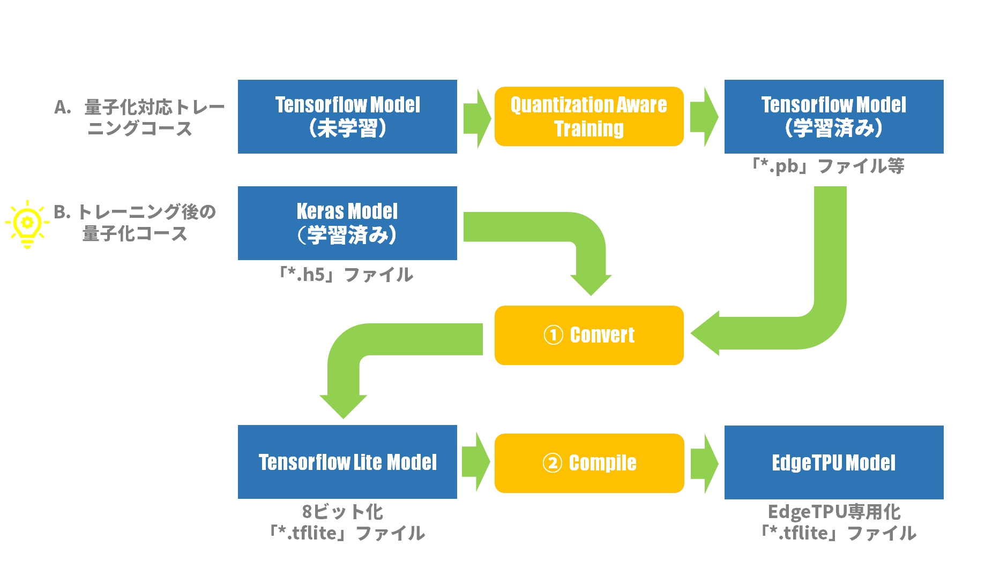
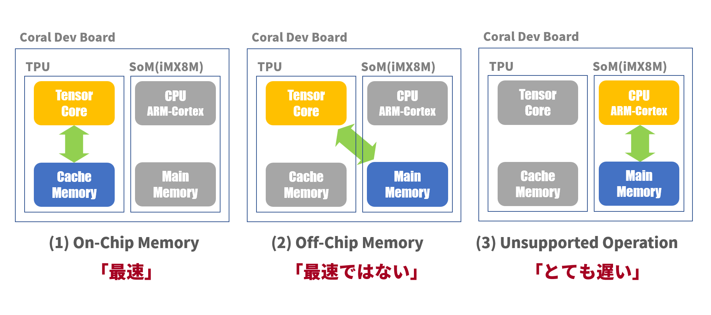
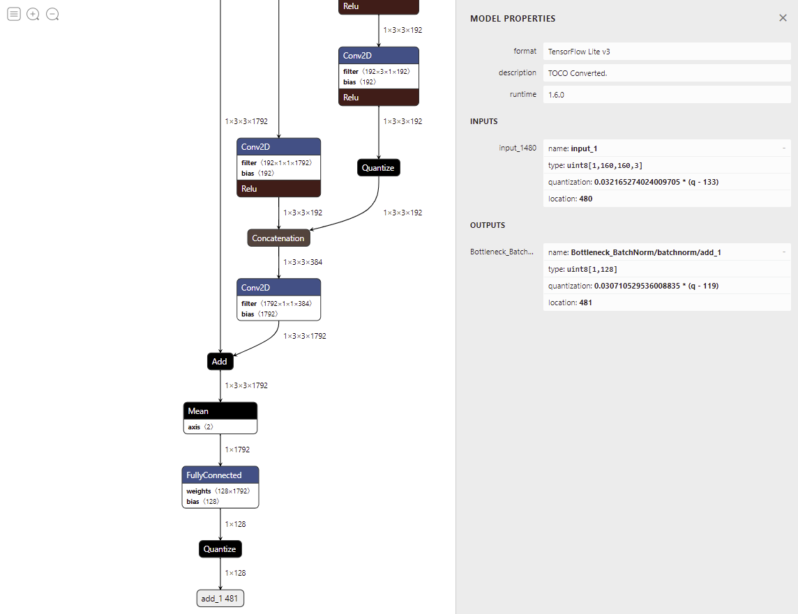
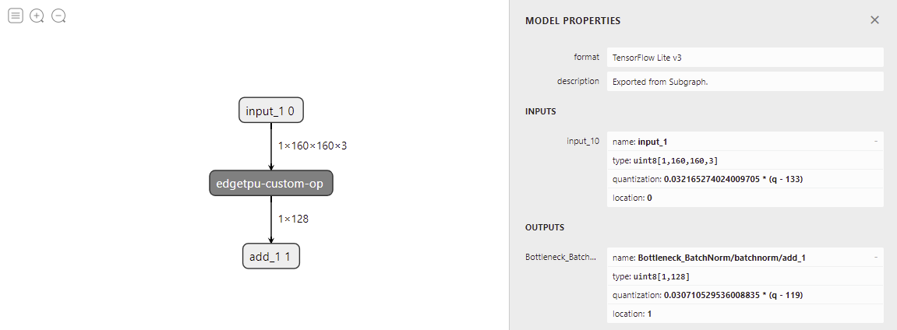
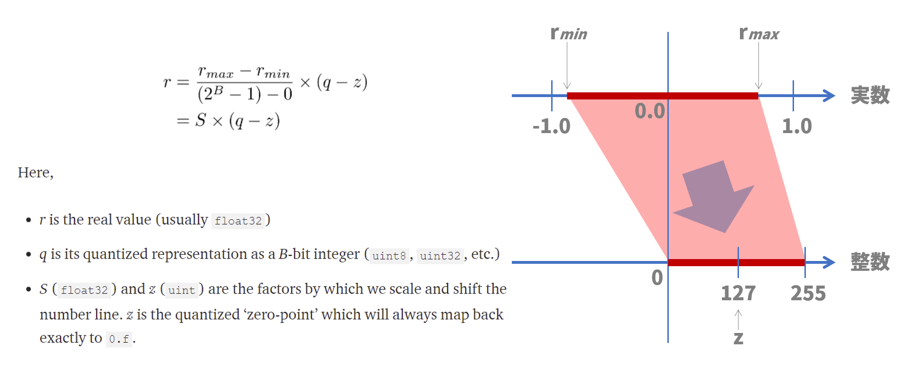

#Edge TPUで顔認証してみる～実装編その３

##１．今回やること

[前回の記事（Edge TPUで顔認証してみる～実装編その２）](https://www.soliton-cyber.com/blog/edgetpu-facedetection-2)では、PCにてFaceNet[[1]](https://github.com/nyoki-mtl/keras-facenet)を実装して、顔エンコーディング（Face Encoding）の結果、正しい埋め込みベクトルが出力されることを確認しました。今回は、まったく同じことをEdgeTPU上で実施しますが、PCで使ったFaceNetのKerasモデルをEdgeTPU用のTensorFlowLiteモデルに変換するところが中心となります。

>参考文献：  
>[1] [FaceNet by Hiroki Taniai](https://github.com/nyoki-mtl/keras-facenet)

##２．EdgeTPU用モデルの作成

一般的に、GPUを使ったテンソル計算では浮動小数点演算が用いられます。しかし、EdgeTPUはテンソル計算のための専用ハードウェアを搭載し、その計算には整数演算が用いられています。したがって、EdgeTPU用のモデルは「重み」「バイアス」などのパラメータも整数で表現されている必要があります。これによってモデルサイズが減少し、計算の高速化、効率化が期待できます。また、EdgeTPU用モデルでは、TPU内のハードウェアリソースの使用可否や割り当てなども意識したモデル作りが求められます。

###（１）EdgeTPU用モデルの作成手順

EdgeTPU用モデルの作り方はCoralサイトにある「Coral：Docs & Tools：Creating a model：Compatibility overview[[2]](https://coral.ai/docs/edgetpu/models-intro/#compatibility-overview)」に説明されていますが、いくつか説明を補足します。Coralサイトによれば、EdgeTPU用モデルの作り方には以下の２通りがあります。

* ####A. 量子化対応トレーニング（QAT：Quantization-aware training）<br>
詳細はいまひとつよくわからないのですが、量子化による影響も考慮したトレーニング（学習）を通して、量子化したときの誤差が最小になるように学習する方法のようです。『ニューラルネットワークのグラフに「偽の」量子化ノードを使用して、トレーニング中の8ビット値の影響をシミュレートします。』とあるので、この手法では最初のトレーニングの前にネットワークを変更する必要があります。なんだかちょっと面倒な感じですが、後述の「トレーニング後の量子化」よりも高い精度のモデルが得られます。Coralサイトではこちらの手法を「推奨」していますが、精度にはそんなに違いはないとの報告もあります[[3]](https://qiita.com/habakan/items/8d4573dbc77003f78c43)。


* ####B. トレーニング後の量子化（Post-training quantization）<br>
我々は既存のモデルを用いることにより楽をしたいので、必然的にこちらの手法を取ります。この手法では以前に学習したモデルをそのまま量子化モデルに変換することができます。ネットワークの修正なしで、「重み」や「バイアス」などのパラメータを量子化するイメージです。ただし、この変換プロセスでは代表的なデータセットを用意する必要があります。つまり、元の学習データセットと同じフォーマットで、同じようなスタイルのデータセットが必要です。この代表的なデータセットにより、量子化処理で活性化と入力のダイナミックレンジ（最大値・最小値）を測定することができます。これは、各重みと活性化値の正確な8ビット表現を見つけるために重要です。

図１はEdgeTPUのモデルを作成するための基本的なワークフローです。我々は既にKerasモデル「facenet_keras.h5」を持っているので、「B. トレーニング後の量子化」コースを選択します。Kerasモデルを直接「①Convert」処理で量子化されたTensorFlowLiteモデルに変換し、さらに「②Compile」処理でEdgeTPUに特化されたTensorFlowLiteモデルに変換します。


<center>
>図１：Edge TPUのモデルを作成するための基本的なワークフロー
</center>


###（２）Representative Datasetの準備

前述の「B. トレーニング後の量子化」において、「ただし、この変換プロセスでは代表的なデータセットを用意する必要があります。」と書きました。ここでは、その「代表的なデータセット」＝「Representative Dataset」を準備します。

####完全な整数量子化（Full integer quantizetion）

「トレーニング後の量子化」において量子化の方法はいくつかあるのですが、EdgeTPUを使うには「完全な整数量子化（Full integer quantizetion）」一択です。Tensorflowサイトのガイドページにて「Full integer qunatizetaion [[4]](https://www.tensorflow.org/lite/performance/post_training_quantization#full_integer_quantization)」という項目がありますが（言語は「English」を選択してください。「日本語」では説明がかなり省かれます！）、ここでは「Representative Dataset」についても述べられています。

>Full integer quantization
>
>You can get further latency improvements, reductions in peak memory usage, and compatibility with integer only hardware devices or accelerators by making sure all model math is integer quantized.
>
>For full integer quantization, you need to calibrate or estimate the range, i.e, (min, max) of all floating-point tensors in the model. Unlike constant tensors such as weights and biases, variable tensors such as model input, activations (outputs of intermediate layers) and model output cannot be calibrated unless we run a few inference cycles. As a result, <font color="red">the converter requires a representative dataset to calibrate them. This dataset can be a small subset (around ~100-500 samples) of the training or validation data.</font>

>完全な整数量子化
>
>すべてのモデル演算が整数値で量子化されていることを確認することで、さらなるレイテンシーの向上、ピークメモリ使用量の削減、整数値のみのハードウェアデバイスやアクセラレータとの互換性を得ることができます。

>完全な整数量子化のためには、モデル内のすべての浮動小数点テンソルの範囲、すなわち（最小、最大）を校正または推定する必要があります。重みやバイアスなどの定数テンソルとは異なり、モデル入力、活性化（中間層の出力）、モデル出力などの可変テンソルは、数回の推論サイクルを実行しない限り、校正することができません。そのため、<font color="red">変換器はそれらを較正するために代表的なデータセットを必要とします。このデータセットは、学習データまたは検証データの小さなサブセット（～100-500サンプル程度）で構いません。</font>

つまり、学習で使ったデータをまた使うということなので、「それじゃ、学習と同じじゃないか」という気もしますが、学習は数百万のデータが必要なのに対して、こちらはせいぜい数百というのが違いというところでしょうか。

####Representative Dataset収集プログラム

ここで問題なのが、FaceNet by Hiroki Taniai [[1]](https://github.com/nyoki-mtl/keras-facenet)の学習で使われたデータセット「MS-Celeb-1M[[5]](https://www.microsoft.com/en-us/research/project/ms-celeb-1m-challenge-recognizing-one-million-celebrities-real-world/) 」の入手が現在では難しいということです。内容的にはインターネットで拾ってきたセレブ画像のようであることと、量子化のための校正処理が目的であることから、厳密に学習データと同じでなくても許されそうです。したがって、[前回の記事（Edge TPUで顔認証してみる～実装編その２）](https://www.soliton-cyber.com/blog/edgetpu-facedetection-2)で用いたセレブ画像データセット「celebrities pictures dataset[[6]](https://www.kaggle.com/mustafa21/celebrities-pictures-dataset)」を再び用いることにします。

前述の文章からサンプル数は100～500程度ということなので300枚の画像を集めます。プログラムの内容は、前回の記事「３．テスト用サンプル画像を準備する」に載せられたプログラムに準じています。ここでは、データセットにあるすべてのJPEGファイルをランダムに読込み、顔検出に成功した顔画像を300枚集めています。

```
#!/usr/bin/env python3
# -*- coding: utf-8 -*-
import os
import cv2
import glob
import random

def face_detect(image, cascade):
    framew = image.shape[0]
    frameh = image.shape[1]
    print("Frame Width: %d, Frame Height: %d" %(framew, frameh))

    # 顔検出チェック
    CROPPED_SIZE = (160, 160)
    image_gray = cv2.cvtColor(image, cv2.COLOR_BGR2GRAY)
    faces = cascade.detectMultiScale(image_gray, scaleFactor=1.1, minNeighbors=3, minSize=CROPPED_SIZE)
    if len(faces) == 0:                 # 検出なしなら次の画像読込みへ
        print("face detection failed")
        return None

    # マージン付き切取りチェック
    maxw = 0
    (x, y, w, h) = (0, 0, 0, 0)
    for face in faces:                  # 幅が一番大きな領域を顔検出領域とする
        if face[2] > maxw:              # face[2] => w
            (x, y, w, h) = face
            maxw = w

    margin = 10
    (top, right, bottom, left) = y - margin//2, x + w + margin//2, y + h + margin//2, x - margin//2
    if top < 0 or left < 0:                     # 切取り座標が負になれば次の画像読込みへ
        print("out of range: left=%d, top=%d" % (left, top))
        return None

    if bottom > frameh or right > framew:       # 切取り座標が元領域を超えれば次の画像読込みへ
        print("out of range: right=%d, bottom=%d" % (right, bottom))
        return None

    return  (top, right, bottom, left)

if __name__ == '__main__':
    # 検出エンジン初期化
    CASCADE_PATH = "opencv-4.2.0/data/haarcascades/haarcascade_frontalface_alt2.xml"
    cascade = cv2.CascadeClassifier(CASCADE_PATH)

    # ファイルパスリストの作成（ランダム）
    #   全ファイル数：774[ファイル]　∵  $ find datasets/ -name '*.jpg' | wc -l => 774
    DATASET_DIR  = "datasets"
    image_paths = []
    for image_path in glob.glob(DATASET_DIR + "/**/*.jpg", recursive=True):
        image_paths.append(image_path)
    random.shuffle(image_paths)

    # ファイル毎に処理
    NUM_OF_IMAGES = 300
    CROPPED_DIR = "cropped"
    count = 0
    for image_path in image_paths:
        # 画像の読み込み
        image = cv2.imread(image_path, cv2.IMREAD_COLOR)

        # 顔検出判定
        ret = face_detect(image, cascade)
        if ret is None:
            continue

        # 顔画像の切り出し
        (top, right, bottom, left) = ret
        image_cropped = image[top:bottom, left:right, :]

        # 顔画像の保存
        cropped_path = os.path.join(CROPPED_DIR, "%03d_%03dx%03d.jpg" % (count, right - left, bottom - top))
        cv2.imwrite(cropped_path, image_cropped)

        # 終了判定
        count += 1
        if count >= NUM_OF_IMAGES:
            break

```
以下は注釈です：
> * 8～39行目：face_detect()関数は前回の記事のものとまったく同じです。単に再掲しました。

> * 115行目：glob()関数で再帰的にJPEGファイルを探します。

Representative Datasetとして使うサンプル顔画像の例として、サムネイル表示の一部を図２に示します。ファイル名は「通し番号」「幅[px]」「高さ[px]」で構成されています。

<center>

>図２：サンプル顔画像（一部）
</center>


###（３）Convert

図１における「➀Convert」処理について説明します。ここでは、Convert処理は既存のKerasモデルを量子化されたTensorFlowLiteモデルに変換する処理となります。この変換がうまくいくかどうかが鍵だったので、言わば本記事での山場となります。

####環境設定

FaceNet by Hiroki Taniai [[1]](https://github.com/nyoki-mtl/keras-facenet)は３，４年前に作られたモデルなので、[前回の記事（Edge TPUで顔認証してみる～実装編その２）](https://www.soliton-cyber.com/blog/edgetpu-facedetection-2)同様、当時の環境に合わせた「再現環境」にてConvertプログラムを動かします。したがって、Tensorflowもバージョン1を使用します。
また、➀Convertも➁CompileもEdgeTPUではなく、ホストマシン（PC：Ubuntu）で実行します。

<center>
>表１：実行環境まとめ（前回記事再掲）
</center>
<center>

|環境名|OS Ver.|Python Ver.|Tensorflow Ver.|Keras Ver.|
|:---|:---|:---|:---:|:---|
|HirokiTaniai環境|Ubuntu16.04|3.6.2|1.3.0|2.1.2|
|再現環境|Ubuntu20.04.1LTS|3.6.8|1.15.0|2.2.4-tf|

</center>

####Convertプログラムの作成

Convertプログラムは「Tensorflow Core V1.15」のPython APIで記述されます。中でも「tf.lite.TFLiteConverter [[7]](https://www.tensorflow.org/versions/r1.15/api_docs/python/tf/lite/TFLiteConverter)」がその中心となります。

```
#!/usr/bin/env python3
# -*- coding: utf-8 -*-
import cv2
import glob
import numpy as np
import tensorflow as tf
from skimage.transform import resize

CROPPED_DIR  = "cropped"

def representative_dataset_gen():
    for file_path in glob.glob(CROPPED_DIR + "/*.jpg"):
        # 画像の読み込み
        image = cv2.imread(file_path, cv2.IMREAD_COLOR)

        # 顔画像のリサイズと[0～255]=>[0～1]変換
        size = (160, 160)
        image_resized = resize(image, size, mode='reflect')

        # 顔画像の標準化
        mean = np.mean(image_resized, axis=(0, 1, 2), keepdims=True)
        std = np.std(image_resized, axis=(0, 1, 2), keepdims=True)
        std_adj = np.maximum(std, 1.0/np.sqrt(image_resized.size))
        image_whiten = (image_resized - mean) / std_adj
        image_whiten = image_whiten.astype('float32')   # tfliteはfloat64を扱ってない

        # 次元調整
        image_calibration = np.expand_dims(image_whiten, axis=0)

        yield [image_calibration]

if __name__ == '__main__':
    converter = tf.lite.TFLiteConverter.from_keras_model_file("facenet_keras.h5")
    converter.representative_dataset = representative_dataset_gen
    converter.target_spec.supported_ops = [tf.lite.OpsSet.TFLITE_BUILTINS_INT8]
    converter.optimizations = [tf.lite.Optimize.DEFAULT]
    converter.inference_input_type = tf.uint8
    converter.inference_output_type = tf.uint8
    tflite_model = converter.convert()

    model_name = "facenet_keras"
    open(model_name + '.tflite', 'wb').write(tflite_model)
```
以下は注釈です：
> * 11～30行目：representative_dataset_gen()関数はPythonのジェネレータ関数です。この関数はconverterに呼ばれる度に、前節で作成された「Represetative Dataset」の300枚の画像を１枚ずつ読み出し、リサイズや標準化を施した上でconverterに返します。リサイズや標準化は学習時にモデルに与えられたであろう画像の条件に合わせるためです。

> * 25行目：一般的なPC＆Ubuntu環境では、標準化された画像はfloat64で計算されます。しかし、TensorFlowLiteの演算ではfloat64に対応していないのでfloat32に変換します。

> * 33行目：TFLiteConverter.from_keras_model_file()でKerasモデルを読み込みます。ちなみにTensorflow2では、このステートメントはTFLiteConverter.from_keras_model()となっているので、Tensorflow2で試す場合にはご注意ください。

> * 35行目：8ビット整数の量子化指示。この指示が無いと、量子化できない演算がある場合、そのままfloat32演算となって残ってしまいます。後に推論処理する際にEdgeTPUでは処理できないのでCPUに演算を頼むこととなり処理が大きく遅れてしまいます。「tf.lite.OpsSet.TFLITE_BUILTINS_INT8」をセットすると、量子化失敗時に変換処理がエラーをthrowするので、気付かずに続行することはありません。

> * 37～38行目：この設定が無いと、モデルの入出力がfloat32になってしまうようなので、モデルの入出力が整数であることを指定します。「tf.int8」か「tf.uint8」が選べるようですが、Tensorflow1.15の場合は「tf.uint8」しか選べないようです（Coralサイト：Docs&Tools：Appendix：Frequently asked questions:"How do I create a TensorFlow Lite model for the Edge TPU?" [[8]](https://coral.ai/docs/edgetpu/faq/)に記述あり）。また、古い推論エンジンを使うと「tf.int8」をサポートしていないので、やはり「tf.uint8」が無難です。

####Convertプログラムの実行

「再現環境」にて勇躍、Convertプログラムを実行したのですが、あれあれ？エラーが・・・

```
$ python3 convert.py
Traceback (most recent call last):
  File "convert.py", line 35, in <module>
    converter = tf.lite.TFLiteConverter.from_keras_model_file("facenet_keras.h5")
...
 File "/home/foobar/.py36/lib/python3.6/site-packages/tensorflow_core/python/keras/saving/hdf5_format.py", line 160, in load_model_from_hdf5
    model_config = json.loads(model_config.decode('utf-8'))
AttributeError: 'str' object has no attribute 'decode'
```

ネットでいろいろ調べたところ、Pythonモジュール「h5py」のバージョンが上がったために悪さをしているようです[[9]](https://qiita.com/Hiroki-Fujimoto/items/b078bfb680fb710c38c1)。そこで、h5pyを古いバージョン(2.10.0)に入れ替えて、その後念のため、tensorflow1.15も入れ替えます：

```
$ pip3 install --upgrade pip
$ pip3 uninstall h5py
$ pip3 uninstall tensorflow
$ pip3 install h5py==2.10.0
$ pip3 install tensorflow==1.15
```

Pythonモジュール修正後、再びConvertプログラムを実行したところ、今度はうまくいきました。プログラムの実行時間は１分未満です（もちろん環境によって異なるでしょうが）。新たなモデルファイル「facenet_keras.tflite」も、無事生成されていました。ファイルのサイズは元のKerasモデルの1/4くらいになっています。

<center>
>表２：モデルファイルサイズの比較その１
</center>
<center>

|モデル種類|ファイル名|サイズ[byte]|
|:---|:---|:---|
|Kerasモデル|facenet_keras.h5|92397640|
|TensorFlowLiteモデル|facenet_keras.tflite|23812408|

</center>

###（４）Compile

EdgeTPUは、畳み込みニューラルネットワーク（CNN）などのフィードフォワード・ニューラルネットワーク（Feedforward Neural Network）の計算処理を実行できます。完全に8ビット量子化され、EdgeTPU用に特別にコンパイルされたTensorFlowLiteモデルのみをサポートします。
EdgeTPU Compilerは、量子化された普通のTensorFlowLiteモデルをEdgeTPUと互換性(compatibility)のあるTensorFlowLiteモデルへ変換するコマンドラインツールです。

####EdgeTPUハードウェアの動作について

「EdgeTPUと互換」なモデルというのは、モデルに含まれる様々なネットワーク計算処理がEdgeTPUの強力な専用ハードウェアで処理されるように表現されたモデルということです。「様々なネットワーク計算処理」は、EdgeTPUでは「Operation/Operator」と呼ばれています。例えば「Conv2d」なら「空間フィルタ：２次元畳み込み層演算」、「MaxPool2d」なら「最大値抽出：２次元最大プーリング層演算」という塩梅でいろいろあります。EdgeTPUで実行可能なOperator一覧が「Coral：Docs&Tools：Creating a model：TensorFlow models orverview：Model requirements：Supported operations [[10]](https://coral.ai/docs/edgetpu/models-intro/#supported-operations)」にあります。

また、EdgeTPUには、モデルのパラメータデータをキャッシュできる約8MBのSRAM（スクラッチパッドメモリ）があります。パラメータデータとは、例えば「重み」や「バイアス」等です。モデルが大きければ一部のパラメータしかこのメモリに載せることができないので、EdgeTPU Compilerがどのパラメータをメモリに載せるか（割り当て）を決定します。

以上を模式的に説明したのが図３です。EdgeTPUハードウェア「Coral Dev Board」はSoM(System on Module)とEdgeTPUコプロセッサで構成されます。推論処理時の動作モードは、ざっくり以下の３種類となります：

* #####(1) On-Chip Memory<br>
Operationは「TensorCore」で実行されます。パラメータデータもキャッシュされている状態であれば、すべてチップ内での演算なので非常に高速に処理されます。

* #####(2) Off-Chip Memory<br>
Operationは「TensorCore」で実行されますが、パラメータデータはキャッシュされていない状態です。この場合、キャッシュの内容はクリアされ、EdgeTPUコプロセッサの外にあるメモリからキャッシュへパラメータデータをロードします。その分、遅延が発生します。

* #####(3) Unsupported Operation<br>
EdgeTPU Compilerがコンパイル時にEdgeTPUで実行できないOperationを発見した場合、その処理をSoMのCPUで実行するようにモデルに設定しておきます。CPUでの処理は非常に遅い（一説には１桁遅くなる）ので、なるべくこの状態を避けなければなりません。

<center>

>図３：EdgeTPUの動作モード
</center>

EdgeTPUを最速で動かすには、カスタマイズされていない一般的なOperationのみを用い、モデルのサイズを8MB以下に抑えてすべてのパラメータデータをキャッシュに載せるような工夫が必要となります。

####EdgeTPU Compilerのシステム要件

EdgeTPU Compiler[[11]](https://coral.ai/docs/edgetpu/compiler/)は、TensorFlowLiteモデル（.tfliteファイル）をEdgeTPUと互換性のあるファイルにコンパイルするコマンドラインツールです。このコマンドはEdgeTPU上ではなく、ホストマシン（PC）で実行します。システム要件は以下の通りです：

* 64-bit version of Debian 6.0 or higher, or any derivative thereof (such as Ubuntu 10.0+)
* x86-64 system architecture　← 「Coral Dev Board」のCPUはARMアーキテクチャなのでこの条件から外れる

また、Compiler（PCでのモデルコンパイラ）とRuntime（EdgeTPUでの推論実行ライブラリ）のバージョンを合わせないとエラーが出るそうなので[[12]](https://coral.ai/docs/edgetpu/compiler/#compiler-and-runtime-versions)、各々のバージョンを調べます。

#####Compilerのバージョンチェック@PC
```
$ edgetpu_compiler --version
Edge TPU Compiler version 15.0.340273435
$
```

#####Runtimeのバージョンチェック@EdgeTPU
EdgeTPUにログインし、Pythonコマンドラインでチェックします：
```
$ python3
>>> import edgetpu.basic.edgetpu_utils
>>> edgetpu.basic.edgetpu_utils.GetRuntimeVersion()
'BuildLabel(COMPILER=6.3.0 20170516,DATE=redacted,TIME=redacted,CL_NUMBER=267685300), RuntimeVersion(12)'
>>>
```
現状のCompilerのバージョンは「15」、Runtimeのバージョンは「12」で、推奨されているRuntimeのバージョンは「13」なので[[12]](https://coral.ai/docs/edgetpu/compiler/#compiler-and-runtime-versions)、現状のRuntimeは少し古いです。しかし、コンパイル時に「--min_runtime_version」オプションを指定すれば、古いRuntimeでも使うことができます。

####EdgeTPU Compilerのインストール
```
$ curl https://packages.cloud.google.com/apt/doc/apt-key.gpg | sudo apt-key add -
$ echo "deb https://packages.cloud.google.com/apt coral-edgetpu-stable main" | sudo tee /etc/apt/sources.list.d/coral-edgetpu.list
$ sudo apt -y update
$ sudo apt -y install edgetpu-compiler
```

####EdgeTPU Compilerの実行

TensorFlowLiteモデル「facenet_keras.tflite」を引数として、「edgetpu_compiler」コマンドを実行します。「--min_runtime_version」オプションでRuntimeのバージョンを指定します。「--show_operations」オプションはログに出力される内容も標準出力に表示します。以下は実行結果の表示です：

```
$ edgetpu_compiler --min_runtime_version 12 --show_operations facenet_keras.tflite
Edge TPU Compiler version 15.0.340273435

Model compiled successfully in 8222 ms.

Input model: facenet_keras.tflite
Input size: 22.71MiB
Output model: facenet_keras_edgetpu.tflite
Output size: 22.43MiB
On-chip memory used for caching model parameters: 7.04MiB　　　　　　　　　← TPU内のメモリに置かれるパラメータ容量
On-chip memory remaining for caching model parameters: 1.25KiB
Off-chip memory used for streaming uncached model parameters: 15.06MiB　　← TPU外のメモリに置かれるパラメータ容量
Number of Edge TPU subgraphs: 1
Total number of operations: 214
Operation log: facenet_keras_edgetpu.log

Operator                       Count      Status

QUANTIZE                       33         Mapped to Edge TPU
MEAN                           1          Mapped to Edge TPU
MAX_POOL_2D                    3          Mapped to Edge TPU
ADD                            21         Mapped to Edge TPU
FULLY_CONNECTED                1          Mapped to Edge TPU
CONCATENATION                  23         Mapped to Edge TPU
CONV_2D                        132        Mapped to Edge TPU
$
                                                  ↑
                                    全部のOperatorがEdgeTPU上で処理される！
```

コンパイルは数秒で完了です。モデルファイルのサイズは元のサイズよりわずかに小さくなりました。

<center>
>表３：モデルファイルサイズの比較その２
</center>
<center>

|モデル種類|ファイル名|サイズ[byte]|
|:---|:---|:---|
|TensorFlowLiteモデル|facenet_keras.tflite|23812408|
|EdgeTPU対応TensorFlowLiteモデル|facenet_keras_edgetpu.tflite|23515704|

</center>

実行結果表示を眺めてみると、OperaterのStatusはすべて「Mapped to Edge TPU」となっており、CPUで実行されるOperationはひとつも無く、すべてTPUで実行されます。一方、On-Chip Memoryが7MB、Off-Chip Memoryが15MBで、1/3くらいのパラメータデータがキャッシュ上で、残りは外のメモリからのロードが必要となりそうです。よって、最高速ではないが、そこそこ高速な処理速度は期待できそうです。


###（５）モデルの可視化

ここまでは、TensorFlowLiteモデルをほとんどブラックボックスとして扱ってきましたが、モデルのネットワークの内容を可視化できるツールがいくつかあります。その中でも、インストール不要でブラウザからすぐアクセスできる「Netron[[13]](https://lutzroeder.github.io/netron/)」を使って可視化してみました。このURLのサイトからモデルファイル（「*.tflite」以外にもいろいろ）をアップロードするだけで、即座にネットワーク図が表示されます。

図４－１はTensorFlowLiteモデル「facenet_keras.tflite」を可視化したものです。この図ではモデルの出力付近のみを表示していますが、全体像はもっともっと深いネットワークとなっています。図では「Conv2D」「FullyConnected」「Quantize」等々の文字が散見されますが、これらがOperatorに相当します。図の右側では「Model Properties」が表示され、モデルの入出力共に「uint8」であることが確認でき、入力テンソルのshapeが(1, 160, 160, 3)、出力テンソルのshapeが(1, 128)であることもわかります。

<center>

>図４－１：facenet_keras.tfliteのネットワーク図
</center>

図４－２はEdgeTPU対応TensorFlowLiteモデル「facenet_keras_edgetpu.tflite」を可視化したものです。すべてのOperatorが「edgetpu-custom-op」としてまとめられています。もしも、CPUで実行されるOperatorがあれば、この図にさらにそのOperatorが追記されることになります。

<center>

>図４－２：facenet_keras_edgetpu.tfliteのネットワーク図
</center>

>参考文献：  
>[2] [Coral：Docs & Tools：Creating a model：Compatibility overview](https://coral.ai/docs/edgetpu/models-intro/#compatibility-overview)  
>[3] [【論文読み】Quantization and Training of Neural Networks for Efficient Integer-Arithmetic-Only Inference](https://qiita.com/habakan/items/8d4573dbc77003f78c43)  
>[4] [TensorFlow：Learn：For Mobile & IoT：Guide：Optimize a model：Post-training quantization：Full integer quantization](https://www.tensorflow.org/lite/performance/post_training_quantization#full_integer_quantization)  
>[5] [MS-Celeb-1M](https://www.microsoft.com/en-us/research/project/ms-celeb-1m-challenge-recognizing-one-million-celebrities-real-world/)   
>[6] [Kaggle：celebrities pictures dataset](https://www.kaggle.com/mustafa21/celebrities-pictures-dataset)  
>[7] [TensorFlow：API：TensorFlow Core v1.15.0：Pythontf.lite.TFLiteConverter](https://www.tensorflow.org/versions/r1.15/api_docs/python/tf/lite/TFLiteConverter)  
>[8] [Coral：Docs&Tools：Appendix：Frequently asked questions](https://coral.ai/docs/edgetpu/faq/)  
>[9] [【Keras】エラー 'str' object has no attribute 'decode'について](https://qiita.com/Hiroki-Fujimoto/items/b078bfb680fb710c38c1)  
>[10] [Coral：Docs&Tools：Creating a model：TensorFlow models orverview：Model requirements：Supported operations](https://coral.ai/docs/edgetpu/models-intro/#supported-operations)  
>[11] [Coral：Docs&Tools：Tools：Edge TPU Compiler](https://coral.ai/docs/edgetpu/compiler/)  
>[12] [Coral：Docs&Tools：Tools：Edge TPU Compiler：Compiler and runtime versions](https://coral.ai/docs/edgetpu/compiler/#compiler-and-runtime-versions)  
>[13] [Netron](https://lutzroeder.github.io/netron/)


##３．顔エンコーディング（Step4）

PC上で作成されたEdgeTPU対応TensorFlowLiteモデルファイルをEdgeTPUにコピーし、ここからはEdgeTPUでの作業となります。

###（１）モデル入力テンソルの量子化について

TensorFlowLiteモデル作成時に、モデルの入力は「uint8」でなければならないことは分かっていたのですが、入力画像は正/負の実数であるため、これをどのように量子化するかがよくわかりませんでした（TensorFlowLiteドキュメントではどうもよくわからない）。たまたま、これを詳しく解説した文献[[14]](https://heartbeat.fritz.ai/8-bit-quantization-and-tensorflow-lite-speeding-up-mobile-inference-with-low-precision-a882dfcafbbd)があったので、これを基に量子化してみました。

量子化の式は図５に示す通りです。これは整数値から実数値を計算する式ですが、逆算して実数値から整数値を導きます。図中の「rmin」「rmax」は入力画像の画素値（実数）の最小値、最大値を示します。この最小値～最大値の幅を、比例的に０～255に変換します。整数軸では127が実数軸での0.0に相当します。具体的にはプログラムでご確認ください。

<center>

>図５：量子化の説明
</center>


###（２）顔エンコーディングプログラム

プログラムの概要は、EdgeTPU対応TensorFlowLiteモデルをロードして、入力顔画像テンソルを標準化（Standardization）した後、量子化を施し、engine.run_inference()にその画像テンソルを入力して埋め込みベクトルを得るという流れです。

以下は顔エンコーディングプログラムです。基本的には、[前回の記事（Edge TPUで顔認証してみる～実装編その２）](https://www.soliton-cyber.com/blog/edgetpu-facedetection-2)の顔エンコーディングプログラムに準じています。

また、実行環境はPythonのバージョンが「3.7.3」です。Runtime：「edgetpu.basic.basic_engine」はインストール済みで、TensorFlowは必要ないのでインストールしていません。Python APIとして「Edge TPU Python API[[15]](https://coral.ai/docs/reference/edgetpu.basic.basic_engine/)」を使っています。今となっては非推奨なのですが、なにぶん古いKerasモデルを基にしているので今回は古い環境に付き合います。

```
#!/usr/bin/env python3
# -*- coding: utf-8 -*-
import cv2
import time
import json
import numpy as np
from edgetpu.basic.basic_engine import BasicEngine

def face_detect(image, cascade):
    ...(前のプログラムと同じ)

if __name__ == '__main__':
    items = []

    # 顔推論エンジン初期化
    MODEL_PATH = "facenet_keras_edgetpu.tflite"
    engine = BasicEngine(MODEL_PATH)

    # 顔検出エンジン初期化
    CASCADE_PATH = "haarcascade_frontalface_alt2.xml"
    cascade = cv2.CascadeClassifier(CASCADE_PATH)

    # サンプル画像ファイルの読込み
    with open('samples.json', mode='rt', encoding='utf-8') as file:
        samples = json.load(file)

    # サンプル画像毎に処理
    for sample in samples:
        name = sample['name']
        item = {}
        item['name'] = name
        embeddings = []

        for image_path in sample['image_paths']:
            # 画像の読み込み
            image = cv2.imread(image_path, cv2.IMREAD_COLOR)

            # 顔検出
            (top, right, bottom, left) = face_detect(image, cascade)

            # 顔画像の切り出しとリサイズ
            image_cropped = image[top:bottom, left:right, :]
            size = (160, 160)
            image_resized = cv2.resize(image_cropped, size, interpolation = cv2.INTER_AREA)
            image_resized = image_resized / 255.0

            # 顔画像の正規化
            mean = np.mean(image_resized, axis=(0, 1, 2), keepdims=True)
            std = np.std(image_resized, axis=(0, 1, 2), keepdims=True)
            std_adj = np.maximum(std, 1.0/np.sqrt(image_resized.size))
            image_whiten = (image_resized - mean) / std_adj
            image_whiten = np.expand_dims(image_whiten, axis=0)

            # 顔画像の量子化
            image_whiten = image_whiten.flatten()
            real_value_min = image_whiten.min()
            real_value_max = image_whiten.max()
            quantized_value_min = 0
            quantized_value_max = 255
            quantized_value_zero = 128
            scale = (quantized_value_max - quantized_value_min) / (real_value_max - real_value_min)
            image_quantized = image_whiten * scale + quantized_value_zero
            image_quantized = image_quantized.astype(np.uint8)

            # 埋め込みベクトル計算
            latency, embedding = engine.run_inference(image_quantized)
            print("Inference Latency：{:.6f}".format(latency) + "[ms]")

            # 埋め込みベクト正規化
            #EPSILON = 1e-10
            #embedding = embedding / np.sqrt(np.maximum(np.sum(np.square(embedding), axis=0, keepdims=True), EPSILON))

            embeddings.append(embedding.tolist())

        item['embeddings'] = embeddings
        items.append(item)

    # 埋め込みベクトルファイルの書込み
    with open('embeddings_tpu.json', mode='wt', encoding='utf-8') as file:
        json.dump(items, file, ensure_ascii=False, indent=2)
```
以下は注釈です：
> * 44～45行目：前回は画像のリサイズにskimageモジュールのresize関数を使いました。しかし、EdgeTPU環境でのskimageモジュールインストール時に、長時間のコンパイルやコンパイルエラーの多発があり、skimageモジュールのインストールを諦めました。代わりに、今回はOpenCVのresizeを使いました。リサイズは縮小のみなのでフラグに「cv2.INTER_AREA」を指定します。また、OpenCVのresizeは各画素0～255の整数値を維持するので、別途0.0～1.0の実数値に変換します。

> * 55行目：image_whiten.shapeは(1, 160, 160, 3)ですが、これを(76800,)へ換えます。推論エンジンのengine.run_inference()は入力/出力テンソルとして１次元テンソルしか認めないためです。ここは予想外な制限事項なので注意が必要です。ちなみに、推論エンジンはモデルの入力テンソルのshapeは知っているようです。（ engine.get_input_tensor_shape()で確認できる）

> * 56～63行目：量子化操作です。図５の内容をそのままプログラム化しました。

> * 66行目：ここがこのプログラムの肝です。engine.run_inference()
は画像テンソルを読込み、(<処理時間[ms]>, <埋め込みベクトル>)の２次元タプルを出力します。埋め込みベクトルの形式（embedding.shape）は(128,)です。

> * 70-71行目：今回は正規化の影響を取り除き、生の埋め込みベクトルで比較を行いたいので、正規化部分はコメントアウトします。

上記プログラムでは、名前と埋め込みベクトルをJSON形式のファイルとして書き出します。このファイルは後段のベクトル表示プログラムに渡されます。ちなみに、engine.run_inference()が出力する処理時間は40[ms]台がほとんどでした。処理速度については、次回考察します。

>参考文献：  
>[14] [8-Bit Quantization and TensorFlow Lite: Speeding up mobile inference with low precision](https://heartbeat.fritz.ai/8-bit-quantization-and-tensorflow-lite-speeding-up-mobile-inference-with-low-precision-a882dfcafbbd)  
>[15] [Coral：Docs&Tools：API Reference：Edge TPU Python API：edgetpu.basic.basic_engine](https://coral.ai/docs/reference/edgetpu.basic.basic_engine/)

##４．埋め込みベクトル可視化する

[前回の記事（Edge TPUで顔認証してみる～実装編その２）](https://www.soliton-cyber.com/blog/edgetpu-facedetection-2)同様に、埋め込みベクトルが５個ずつ３つのグループに分かれるかどうかを視覚的に確認します。手法も可視化プログラムも前回の記事とまったく同じです。ただし、今回は正規化（ベクトルの長さを１にする）の影響を取り除き、「生」の埋め込みベクトルで比較してみました。

比較結果が図６です。左図が今回EdgeTPUで得たEdgeTPU対応TensorFlowLiteモデルの埋め込みベクトル、右図が前回PCで得たKerasモデルの埋め込みベクトル（ただし正規化していない）です。どうでしょうか？両者はだいたい似通った傾向と言ってよいのではないでしょうか。量子化されているとは言え、EdgeTPU対応TensorFlowLiteモデルも顔の識別には十分使えそうです。

<center>

>図６：埋め込みベクトルの分布比較（左：EdgeTPU対応TensorFlowLiteモデル、右：Kerasモデル）
</center>

##５．続きは？

やっとFaceNetをEdgeTPUに実装するところまで来ました。EdgeTPU上でもFaceNetモデルが正しく動作したので一安心です。これで「顔エンコーディング（Step4）」まで進んだので次回は「顔分類（Step5）」実装の予定です。ここまでサンプル画像としてセレブ画像を用いてきましたが、次回以降はカメラで撮った我々自身の顔画像を使っていろいろ試してみたいと思います。

